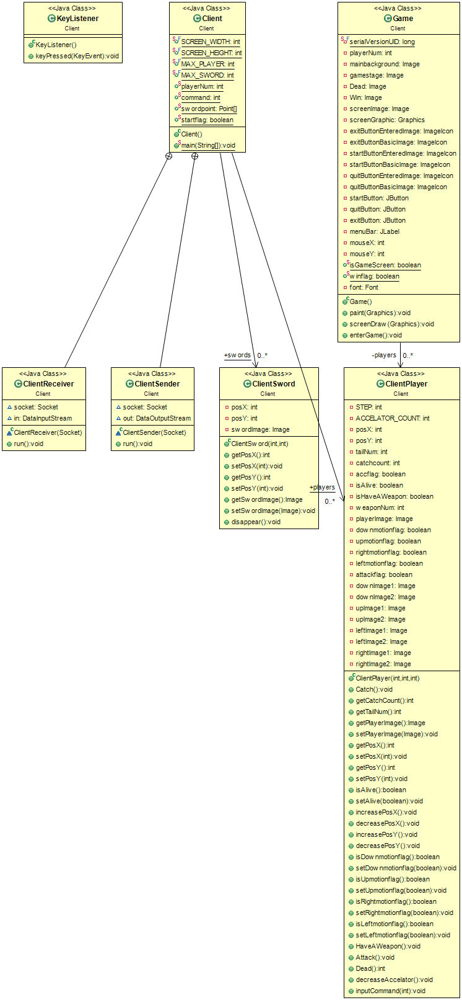
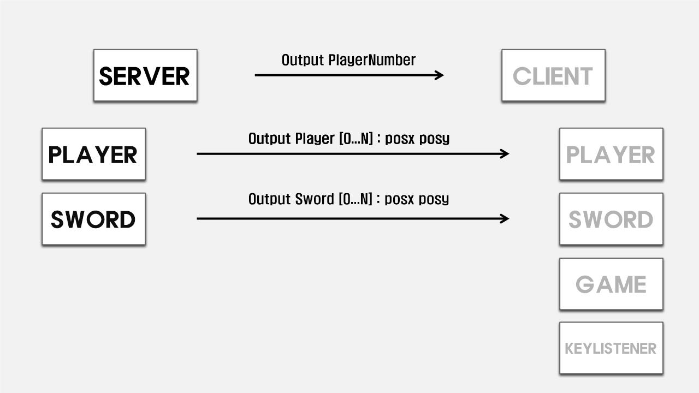
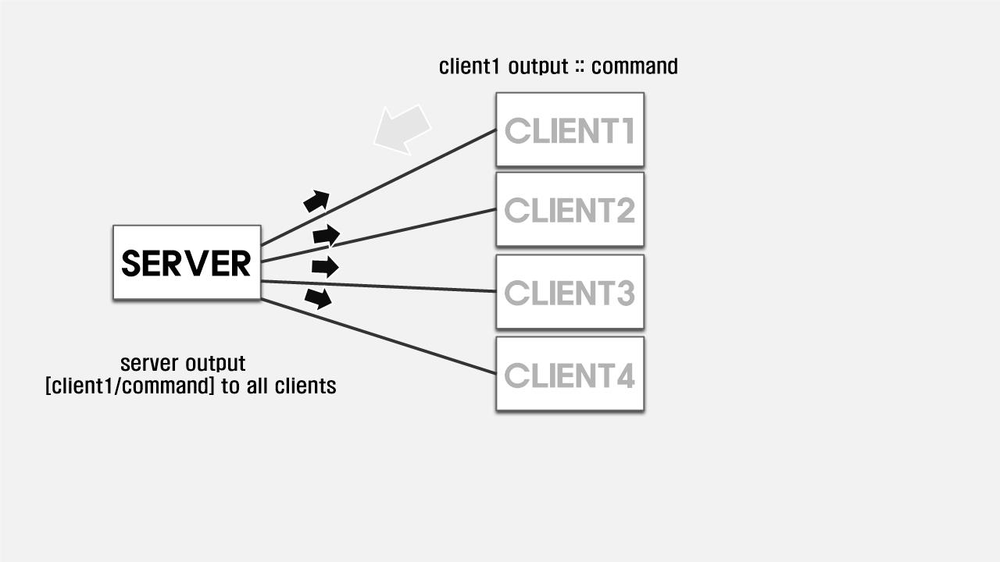
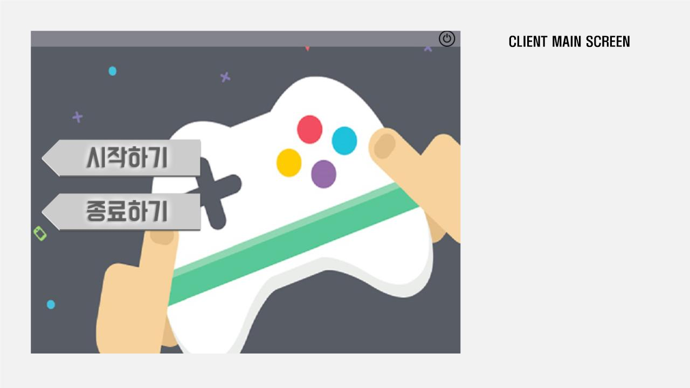
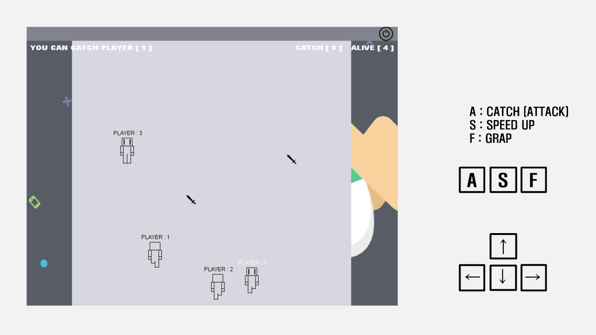
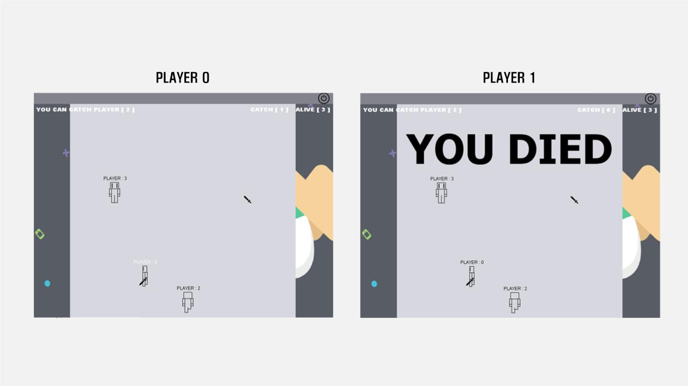
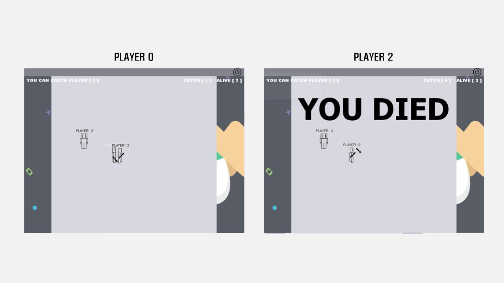
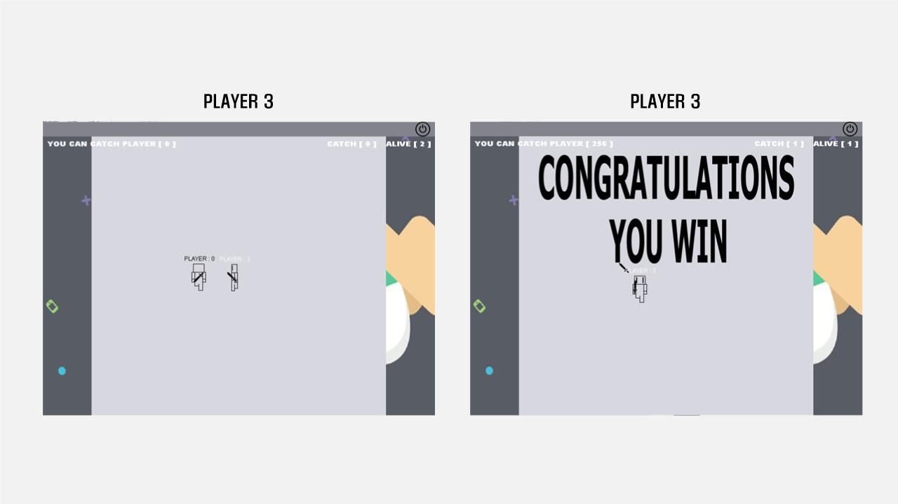

# CatchATail(Multiplayer)

Java Swing 과 MutilThread Sokect Programming 을 이용한 꼬리잡기 게임입니다.

## 영상

# 사용법

이 프로그램은 서버와 클라이언트가 개별입니다. 서버를 가동해 서버(pc)에 클라이언트들을 접속시켜야 합니다.

서버의 IP는 localhost로 고정되어 있습니다.

# 게임 방법

## 인원

4인

## 키

* A : 공격
* F : 무기 줍기
* ↑ ↓ ← →

## 규칙

자신이  잡을 수 있는 꼬리(플레이어)는 한명입니다.

자신이 잡을 수 있는 꼬리(플레이어) 숫자는 왼쪽 상단에 표시됩니다.

무기를 가진 자만이 꼬리(플레이어)를 잡을 수 있습니다.
※무기는 필드에 두 개 만 드롭 됩니다.

## 승리

자신을 제외한 꼬리(플레이어)가 모두 사라지면 승리합니다.

# Class Diagram

* Client

* Server

# ppt

